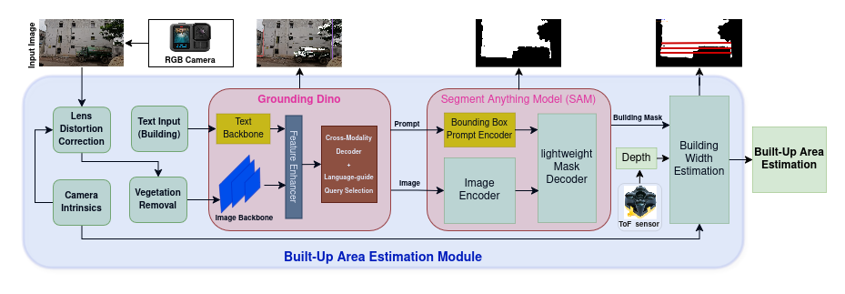
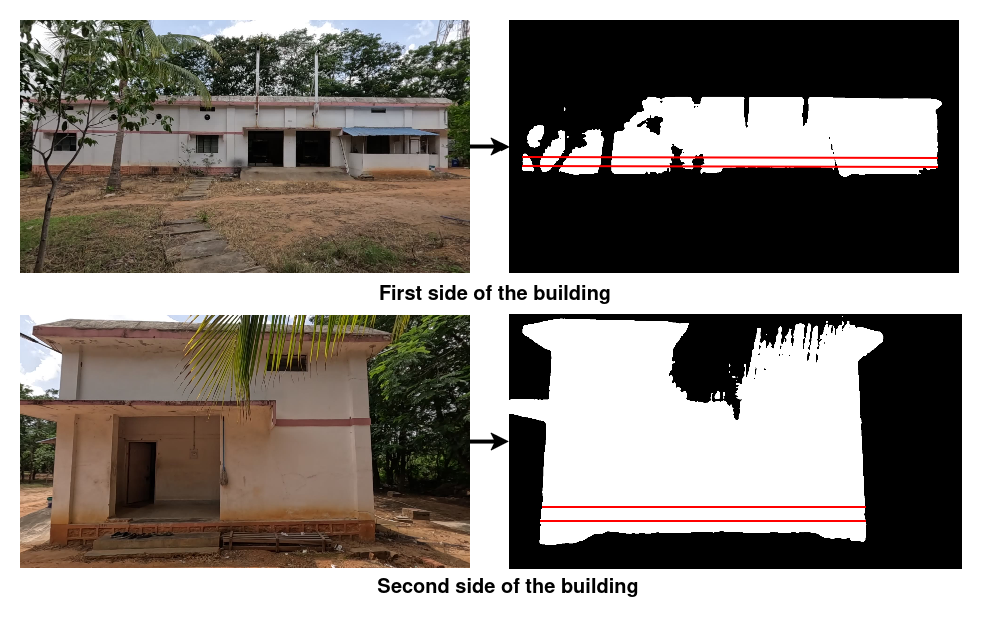

# Built-Up Area Estimation

This repository contains the supplementary material associated with the paper:

**"Built-Up Area Estimation from Handheld RGB-D Sensing Enabled by Vision Foundation Models"**

submitted to *IEEE Sensors Letters*.

---
## Introduction and Method Overview

This repository provides supplementary material supporting a vision-based
approach for estimating the built-up (footprint) area of buildings from
handheld RGB-D data. The proposed pipeline processes images acquired using a
handheld RGB camera and a synchronized Time-of-Flight (ToF) depth sensor, and
integrates open-vocabulary object detection, prompt-based segmentation, and
geometric reasoning to obtain reliable facade measurements.

Despite recent advances, existing methods primarily rely on aerial or satellite
imagery and estimate built-up area from roof projections, which may include
**roof overhangs or architectural extensions**. In contrast, the proposed
street-level RGB-D approach directly measures facade dimensions at ground
level, enabling estimation of the true structural built-up area without custom
training or specialized surveying equipment.

---

## Proposed Built-Up Area Estimation Pipeline

The figure below illustrates the architecture of the proposed automated
Built-Up Area Estimation Module. The pipeline employs Grounding DINO for building
detection, the Segment Anything Model (SAM) for facade segmentation, and a
geometry-based width estimation stage to compute the final built-up area from
two orthogonal facade views.

---

## Qualitative Example

An example of built-up area estimation for a representative building is shown
below. Images were captured from two orthogonal sides of the structure along
with their corresponding depth measurements. Vegetation removal improves the
visibility of structural features, enabling accurate facade segmentation at an
approximate stand-off distance of 15 m.

**Ground Truth Area:** 183.885 m²  
**Estimated Built-Up Area:** 192.286 m²  
**Relative Error:** 4.568 %

---

## Quantitative Error Analysis

The table below summarizes the statistical error metrics for facade width and
built-up area estimation across the evaluated buildings. Errors are computed
with respect to tape-measured ground truth.

| Error Metric | Estimated Width Error (%) | Estimated Built-Up Area Error (%) |
|:------------:|:-------------------------:|:---------------------------------:|
| Mean error (μₑ) | 2.054 | 3.240 |
| Standard deviation error (σₑ) | 1.327 | 2.237 |
| Maximum error (eₘₐₓ) | 4.4 | 7.424 |

---

## Repository Contents

- `supplementary_material.pdf`  
  Detailed per-building results, additional figures, and extended quantitative
  evaluation supporting the main paper.

- `architecture_pipeline.png`  
  Visual illustration of the proposed Built-Up Area Estimation pipeline.

---

## Access to Supplementary Material

The supplementary PDF can be accessed directly at:  
https://jayakant-kumar.github.io/built-up-area-supplementary/supplementary_material.pdf

---

## Note

This repository is intended solely for academic review and research
dissemination purposes.
